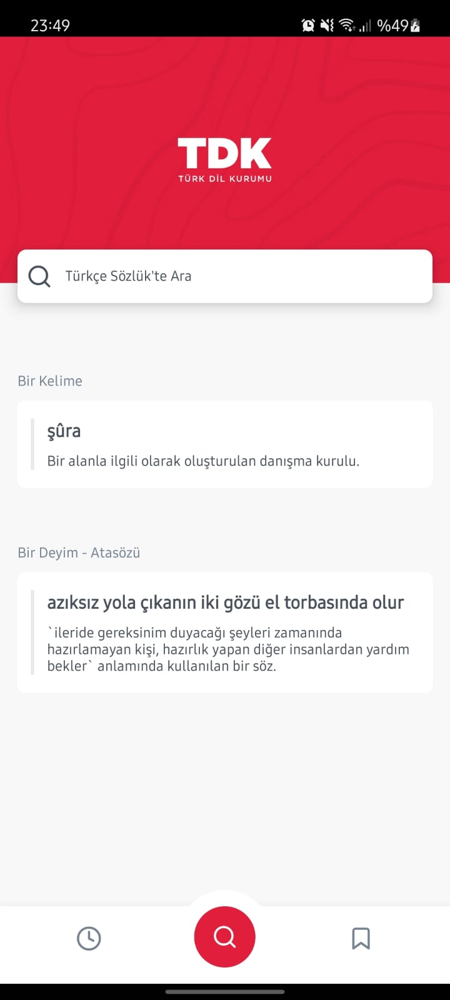
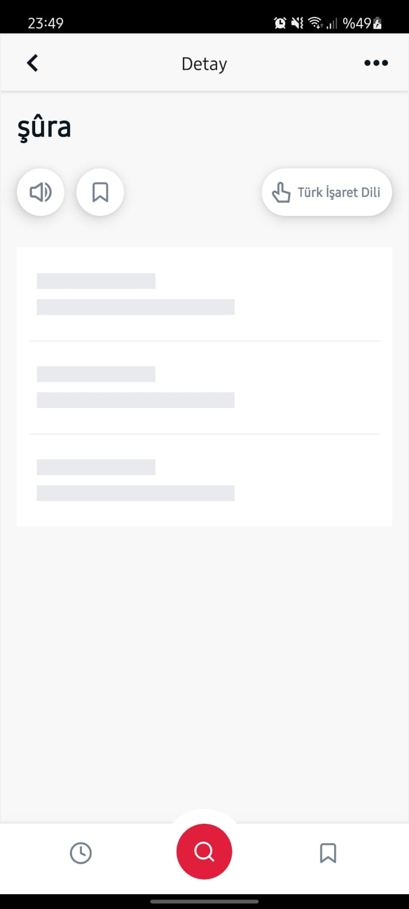
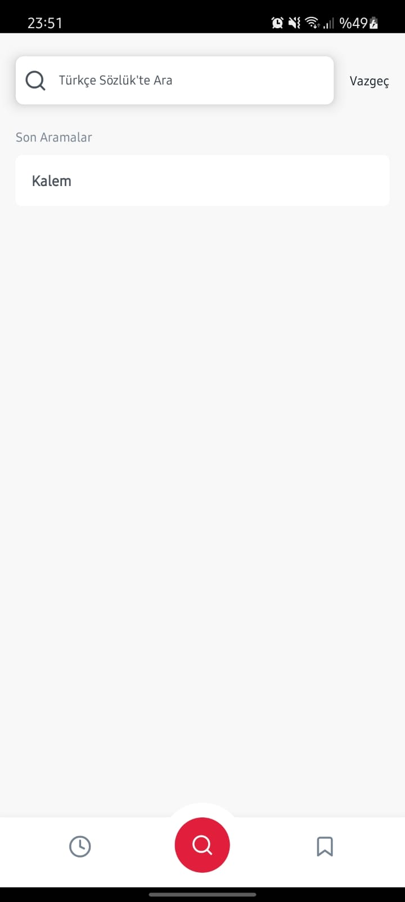

# Türkçe Sözlük

   

## Teknoloji

React Native

## Tools

- React Navigation
- Animated
- Proposal Optional Chaining

## Özellikler

- TDK'nın API'sinden bir kelime, atasözü ve deyim verilerinin alınması.
- Tıklanın öğrenin detay sayfasına gidilmesi.
- Verilerin yüklendiği sırada yükleniyor durumu gösterilmesi.

## Kurulum

Bu depoyu yerel makinenizde klonlayın.

```
git clone https://github.com/ibrahimaykutbas/TurkceSozluk.git
```

### Hazırlık

Projeyi klonladıktan sonra ilgili dizine gidin.

```
cd TurkceSozluk
code .
```

Proje bağımlılıklarını yüklemek için proje dizininde aşağıdaki komutları çalıştırın.

```
npm install
```
Eğer macOS kullanıyorsanız ve iOS işletim sistemine sahip bir cihazda projeyi başlatacaksanız pod'ları yükleyin.

```
cd ios
pod install
```

### Kullanım

Projeyi başlatmak için aşağıdaki komutları kullanın.

```
npx react-native run-android
--or--
npx react-native run-ios
```

## Daha Fazla Bilgi İçin

Daha fazlasını şuradan öğrenebilirsiniz: [React documentation](https://reactnative.dev/)
